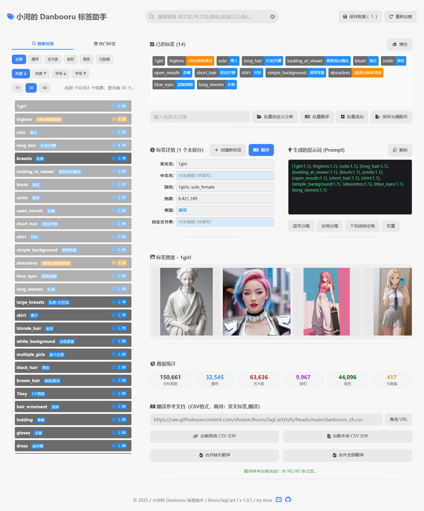

---

# 小河的 Danbooru 标签助手  

  <h3><a href="https://xhoxye.github.io/BooruTagCart/"> >> Demo 网站 <<</a></h3>
  <h3><a href="https://xhoxye.github.io/BooruTagCart/SimpAI_TagCart_index.html"> >> SimpAI 内嵌标签助手 测试 Demo 网站 <<</a></h3>

# BooruTagCart 🛒

**BooruTagCart** 是你的一站式 Danbooru 标签助手，旨在彻底简化 AI 绘画的提示词构建流程，尤其针对 Stable Diffusion 等模型的动漫风格图像生成。

它就像一个专门为 Danbooru 标签设计的购物车——轻松浏览、挑选、组合和管理标签，为你下一张杰作构建出最完美的提示词。

> [!TIP]
> 还在手动管理记事本里的标签吗？BooruTagCart 将帮助你搜索、管理、组合、编辑、翻译标签，并一键生成可用的提示词（Prompt）和通配符（Wildcard），将你从繁琐的工作中解放出来。  

> 所有文件可以自行下载，打造自己的标签库。可以本地运行，无需网络，它只是一个静态 Html 文件，加上 csv 数据文件。

## 界面截图

## 🌟 核心功能

* **🏷️ 高效的标签管理**
    轻松管理你的标签库。你可以按项目或风格分组，使用自定义分类，自由地添加、删除和整理标签集合。

* **🔍 强大的搜索与发现**
    内置完整的 Danbooru 标签数据库，支持模糊搜索、自动补全和筛选。帮助你快速找到想要的标签，并发现激发灵感的新标签。还可以创建新标签，并保存到数据库中，以供下次使用。（以 danbooru 2025-05-01 数据源为基础构建，合并了多个来源和自己校正的中文翻译）

* **✨ 便捷的提示词构建**
    通过直观的点选，自由组合和排序标签。你还可以批量添加标签，或者一键清空标签，并实时预览效果。

* **🌐 内置标签翻译**
    无需离开应用，即可在中文、英文等多种语言之间快速翻译标签，帮你理解其确切含义，解锁更多创意。

* **🤖 智能生成提示词**
    根据你挑选的标签，自动生成适配 AI 绘画模型的标准提示词（Prompt），多种格式化，可直接复制使用。

* **`*` 通配符生成器**
    一键将你的标签集合转化为通配符（Wildcard）文件。这对于在 SimpAI、Fooocus、Stable Diffusion WebUI (如 A1111/Forge) 和 ComfyUI 中实现画面元素的随机组合、增加多样性非常有用。

## 🧑‍🎨 为谁设计？

**BooruTagCart** 是为以下人群量身打造的：

* **AI 绘画玩家与创作者**：任何使用 Text-to-Image 模型进行创作的用户。
* **动漫风格爱好者**：专注于生成高质量动漫、二次元风格图像的创作者。
* **Stable Diffusion 用户**：使用 SimpAI、Fooocus、Automatic1111、SD.Next、ComfyUI 或其他依赖精细化标签进行绘画的用户。
* **提示词工程师 (Prompt 工程师)**：希望提升复杂提示词构建效率和创造力的专业玩家。

---

告别繁琐的标签整理，开始专注于创作本身。
有了 **BooruTagCart**，完美提示词的构建尽在指尖。

---
## 数据源
[Danbooru](https://danbooru.donmai.us/)  
[标签补全插件 SD WebUI Tag Autocomplete](https://github.com/DominikDoom/a1111-sd-webui-tagcomplete)  
[Danbooru/e621 tag lists archive](https://github.com/DraconicDragon/dbr-e621-lists-archive)